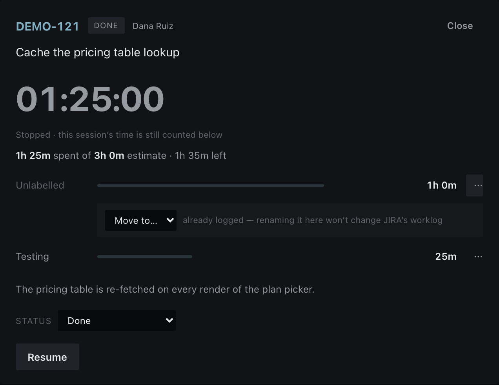

# JIRA Timer

A small timer that runs on your own machine, lists the JIRA stories assigned to
you, and tracks **active** time against one story while you work. When you're
done it logs the hours to JIRA as a worklog and can move the story's status.

It exists to answer "estimate vs. actual" honestly. Leaving the window open all
weekend adds nothing — only start→stop segments count.


Everything stays local: your API token lives in a file on your machine, the
timer's history is a JSON file in your home folder, and nothing is shared with
anyone else.

## What it gives you

**Your board's columns, in your board's order.** Stories are grouped **To Do → In
Progress → Done**, taken from JIRA's own status categories — so a team that renames
"In Progress" to "In Test" gets it filed correctly with no configuration. A fourth
group, *Tracked elsewhere*, catches stories you've tracked time against that this
board no longer lists, so that time can never quietly vanish.

**Time that stays on screen when you stop.** Pausing doesn't collapse the story back
to a one-line row. The clock, the estimate line and the activity breakdown all stay
put, so you can see what you just measured without starting the clock again.

**A breakdown of where the time went.** Every activity gets a bar, always — not only
while the clock runs. Each bar shows what's already in JIRA at lower opacity and
what's still waiting to be sent at full, so "what will Done actually log?" is
answerable at a glance.

**Open any story for the full picture.** Collapsed rows stay short and scannable;
click the `⌄` on any of them for the same card the running story gets.



**Fix up time after the fact.** Stopped a timer without labelling it, or labelled it
wrongly? Each row in the breakdown offers **Move to…** to reattribute it and
**Remove…** to throw it away. Time already sent to JIRA can be renamed here but not
deleted — the app won't let your local record claim less time than JIRA has been told
about.

**Move a story between columns.** An open card carries a status dropdown offering
every transition JIRA allows, in either direction. And if you start a timer on
something still sitting in To Do, the card offers to move it to In Progress for you.

**Done finishes the story.** The Done dialog preselects a transition into the Done
column rather than leaving the status untouched — while deliberately skipping
`Cancelled`, `Won't Do` and friends, so finished work is never written off as
abandoned by default.

## Get it running

You'll need [Node.js](https://nodejs.org) 18.17 or newer (`node -v` to check).

```bash
git clone https://github.com/flpetho/jira-timer.git
cd jira-timer
npm install
npm run dev
```

Open **http://localhost:4100**. You'll land on a setup screen, because the app
doesn't have your JIRA credentials yet:


Follow the three steps it gives you:

1. **Create a JIRA API token** at
   [id.atlassian.com/manage-profile/security/api-tokens](https://id.atlassian.com/manage-profile/security/api-tokens).
   Copy it before closing the dialog — Atlassian only shows it once.
2. **Fill in `.env.local`**, which the app created for you on first run:

   ```
   JIRA_BASE_URL=https://your-org.atlassian.net
   JIRA_EMAIL=you@example.com
   JIRA_API_TOKEN=the-token-you-just-copied
   ```

   `JIRA_BASE_URL` is the address you see when JIRA is open in your browser,
   with nothing after the hostname. `JIRA_EMAIL` must be the account that
   created the token.
3. **Save the file.** Leave the browser open — the screen connects on its own
   within a few seconds. No restart needed.

Then pick your board from the dropdown and start a timer.

### If something doesn't work

The setup screen tells you which of the three problems you have, but for
reference:

| What you see | What it means |
|---|---|
| Some settings "are not set" | A line in `.env.local` is missing, blank, or still has the example value |
| "JIRA rejected your credentials" | Token expired or revoked, or `JIRA_EMAIL` isn't the account that made it |
| "Couldn't reach …" | `JIRA_BASE_URL` is wrong, or you need to be on the VPN |
| Port 4100 already in use | Something else is on that port — run `npm run dev -- -p 4101` instead |

Your board list comes from JIRA, so if a board is missing there, check you can
see it in JIRA itself with the same account.

## Make it yours

This is intentionally small and readable — around 3,000 lines of TypeScript and one
hand-written stylesheet, no database, no accounts, no state management library, no
build step beyond Next.js. It's a good size to poke at with
[Claude Code](https://claude.com/claude-code).

The repo includes a `CLAUDE.md` describing the architecture and the traps, so Claude
already knows its way around. Things people usually want first:

- Round logged time differently (`TIMER_ROUND_MINUTES`, or change the rule outright)
- Show a daily or weekly total across stories
- Change the colours — they're all CSS variables at the top of `app/globals.css`
- Default to a specific board (`JIRA_BOARD_MATCH`)
- Add a note field that always prefills the same text
- Export your tracked time as CSV
- Collapse the Done column by default, or hide it entirely

Ask for what you want in plain language:

```
> add a "today" total at the top showing all time tracked since midnight
```

Run `npm test` afterwards — the time and state logic is covered, so you'll know
quickly if something broke.

## How it works

- **Connection check** (`GET /api/me`) validates your token against JIRA
  `/myself` and reports exactly what's wrong when it fails.
- **Board picker** (`GET /api/boards`) lists every board you can see. The one
  preselected on load comes from `JIRA_BOARD_MATCH`, else the first board.
- **Story list** (`GET /api/stories?board=&mine=`) pulls the board's active
  sprint, falling back to all board issues when there's no active sprint, and —
  unless you switch to "Everyone" — to you. It splits on JIRA's `statusCategory`,
  which is what makes the columns agree with the board even for a story sitting in
  Done with no resolution set. It never touches the local timer store, so timer
  buttons don't wait on JIRA.
- **Start/Pause** open and close time segments. Active time is the sum of
  segments (`lib/time.ts`), which is why idle time never counts.
- **Stop and log as…** closes the current segment and tags it with an activity
  (meeting, building, testing — see `JIRA_ACTIVITIES`). The story stays open; only
  Done writes to JIRA, and it posts one worklog per activity so the breakdown is
  visible in the issue's Work Log tab.
- **Move / Remove** (`POST /api/timer`) reattribute or discard tracked time. Local
  only, like every timer action — they change what a *future* Done will send, never
  what one already sent.
- **Status changes** (`POST /api/transitions`) move a story without logging
  anything, which is why starting a timer still works when JIRA is unreachable.
- **Done** posts a worklog rounded to `TIMER_ROUND_MINUTES` and optionally
  transitions the story. It logs only what JIRA doesn't already have, so pressing
  Done twice can't double-count, and it reads JIRA's `aggregatetimespent` so a
  parent whose work happens in subtasks doesn't report zero.
- State lives in `~/.jira-timer/state.json` — plain readable JSON that survives
  restarts and accrues across days.

Three quantities are kept deliberately distinct, and the app is careful never to
conflate them: what JIRA says is spent (including worklogs made before you installed
this), what this app has sent, and what it has measured but not sent yet.

## Settings (`.env.local`)

| var | meaning |
|-----|---------|
| `JIRA_BASE_URL` | your JIRA site, e.g. `https://your-org.atlassian.net` |
| `JIRA_EMAIL` | the Atlassian account that created the token |
| `JIRA_API_TOKEN` | your personal API token — never commit this |
| `JIRA_BOARD_MATCH` | part of a board name to preselect; blank = first board |
| `JIRA_ACTIVITIES` | comma-separated activity labels; blank turns the feature off |
| `TIMER_ROUND_MINUTES` | round logged time to the nearest N minutes (default 5) |

`.env.local` is gitignored. Don't put your token anywhere else.

## Keeping it always on (macOS)

Once you're happy with it, a launchd agent can serve the production build on
port 4100 from login, so the timer is always a tab away.

```bash
npm run build
sh scripts/service.sh start     # start|stop|restart|status|update
```

After any code or credential change the agent needs rebuilding and restarting,
because unlike `npm run dev` it reads `.env.local` only at startup. Easiest is to
ask Claude Code:

```
> restart the JIRA timer so it picks up my new credentials
```

Or do it yourself with `sh scripts/service.sh update`.

## Tests

```bash
npm test          # 113 tests
npx tsc --noEmit  # typecheck
```

Pure logic only: segment maths, timer state transitions, board-column grouping,
activity attribution and connection classification. There's no rendering harness — if
you add a feature with real logic in it, put that logic in a function in `lib/` and
test it there. That's why `lib/stages.ts` and `lib/timer-logic.ts` hold the rules and
`app/page.tsx` mostly just renders what they return.
