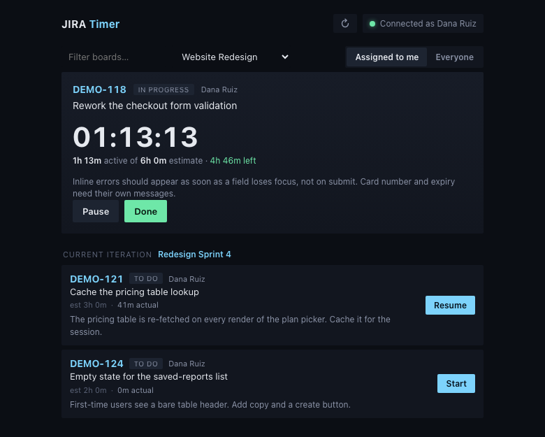
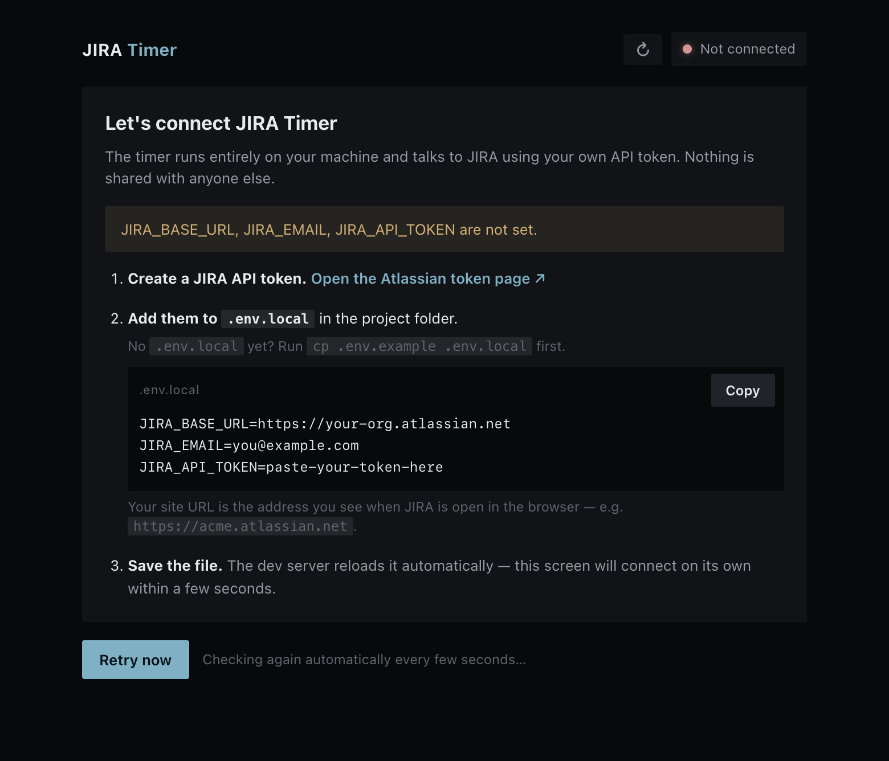

# JIRA Timer

A small timer that runs on your own machine, lists the JIRA stories assigned to
you, and tracks **active** time against one story while you work. When you're
done it logs the hours to JIRA as a worklog and can move the story's status.

It exists to answer "estimate vs. actual" honestly. Leaving the window open all
weekend adds nothing — only start→stop segments count.



Everything stays local: your API token lives in a file on your machine, the
timer's history is a JSON file in your home folder, and nothing is shared with
anyone else.

## Get it running

You'll need [Node.js](https://nodejs.org) 18.17 or newer (`node -v` to check).

```bash
git clone https://github.com/flpetho/jira-timer.git
cd jira-timer
npm install
npm run dev
```

Open **http://localhost:4100**. You'll land on a setup screen, because the app
doesn't have your JIRA credentials yet:



Follow the three steps it gives you:

1. **Create a JIRA API token** at
   [id.atlassian.com/manage-profile/security/api-tokens](https://id.atlassian.com/manage-profile/security/api-tokens).
   Copy it before closing the dialog — Atlassian only shows it once.
2. **Fill in `.env.local`**, which the app created for you on first run:

   ```
   JIRA_BASE_URL=https://your-org.atlassian.net
   JIRA_EMAIL=you@example.com
   JIRA_API_TOKEN=the-token-you-just-copied
   ```

   `JIRA_BASE_URL` is the address you see when JIRA is open in your browser,
   with nothing after the hostname. `JIRA_EMAIL` must be the account that
   created the token.
3. **Save the file.** Leave the browser open — the screen connects on its own
   within a few seconds. No restart needed.

Then pick your board from the dropdown and start a timer.

### If something doesn't work

The setup screen tells you which of the three problems you have, but for
reference:

| What you see | What it means |
|---|---|
| Some settings "are not set" | A line in `.env.local` is missing, blank, or still has the example value |
| "JIRA rejected your credentials" | Token expired or revoked, or `JIRA_EMAIL` isn't the account that made it |
| "Couldn't reach …" | `JIRA_BASE_URL` is wrong, or you need to be on the VPN |
| Port 4100 already in use | Something else is on that port — run `npm run dev -- -p 4101` instead |

Your board list comes from JIRA, so if a board is missing there, check you can
see it in JIRA itself with the same account.

## Make it yours

This is intentionally small and readable — around 1,400 lines of TypeScript, no
database, no accounts, no build step beyond Next.js. It's a good size to poke at
with [Claude Code](https://claude.com/claude-code).

The repo includes a `CLAUDE.md` describing the architecture, so Claude already
knows its way around. Things people usually want first:

- Round logged time differently (`TIMER_ROUND_MINUTES`, or change the rule outright)
- Show a daily or weekly total across stories
- Change the colours — they're all CSS variables at the top of `app/globals.css`
- Default to a specific board (`JIRA_BOARD_MATCH`)
- Add a note field that always prefills the same text
- Export your tracked time as CSV

Ask for what you want in plain language:

```
> add a "today" total at the top showing all time tracked since midnight
```

Run `npm test` afterwards — the time and state logic is covered, so you'll know
quickly if something broke.

## How it works

- **Connection check** (`GET /api/me`) validates your token against JIRA
  `/myself` and reports exactly what's wrong when it fails.
- **Board picker** (`GET /api/boards`) lists every board you can see. The one
  preselected on load comes from `JIRA_BOARD_MATCH`, else the first board.
- **Story list** (`GET /api/stories?board=&mine=`) pulls the board's active
  sprint, falling back to all board issues when there's no active sprint,
  filtered to unresolved and — unless you switch to "Everyone" — to you. It
  never touches the local timer store, so timer buttons don't wait on JIRA.
- **Start/Pause** open and close time segments. Active time is the sum of
  segments (`lib/time.ts`), which is why idle time never counts.
- **Stop and log as…** closes the current segment and tags it with an activity
  (meeting, building, testing — see `JIRA_ACTIVITIES`). The story stays open; only
  Done writes to JIRA, and it posts one worklog per activity so the breakdown is
  visible in the issue's Work Log tab.
- **Done** posts a worklog rounded to `TIMER_ROUND_MINUTES` and optionally
  transitions the story. The returned worklog id is stored so a story can't be
  logged twice.
- State lives in `~/.jira-timer/state.json` — plain readable JSON that survives
  restarts and accrues across days.

## Settings (`.env.local`)

| var | meaning |
|-----|---------|
| `JIRA_BASE_URL` | your JIRA site, e.g. `https://your-org.atlassian.net` |
| `JIRA_EMAIL` | the Atlassian account that created the token |
| `JIRA_API_TOKEN` | your personal API token — never commit this |
| `JIRA_BOARD_MATCH` | part of a board name to preselect; blank = first board |
| `JIRA_ACTIVITIES` | comma-separated activity labels; blank turns the feature off |
| `TIMER_ROUND_MINUTES` | round logged time to the nearest N minutes (default 5) |

`.env.local` is gitignored. Don't put your token anywhere else.

## Keeping it always on (macOS)

Once you're happy with it, a launchd agent can serve the production build on
port 4100 from login, so the timer is always a tab away.

```bash
npm run build
sh scripts/service.sh start     # start|stop|restart|status|update
```

After any code or credential change the agent needs rebuilding and restarting,
because unlike `npm run dev` it reads `.env.local` only at startup. Easiest is to
ask Claude Code:

```
> restart the JIRA timer so it picks up my new credentials
```

Or do it yourself with `sh scripts/service.sh update`.

## Tests

```bash
npm test          # time maths, timer state transitions, connection classification
```
